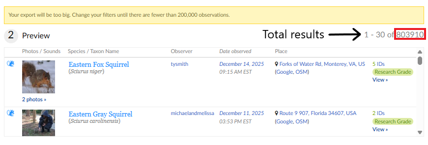
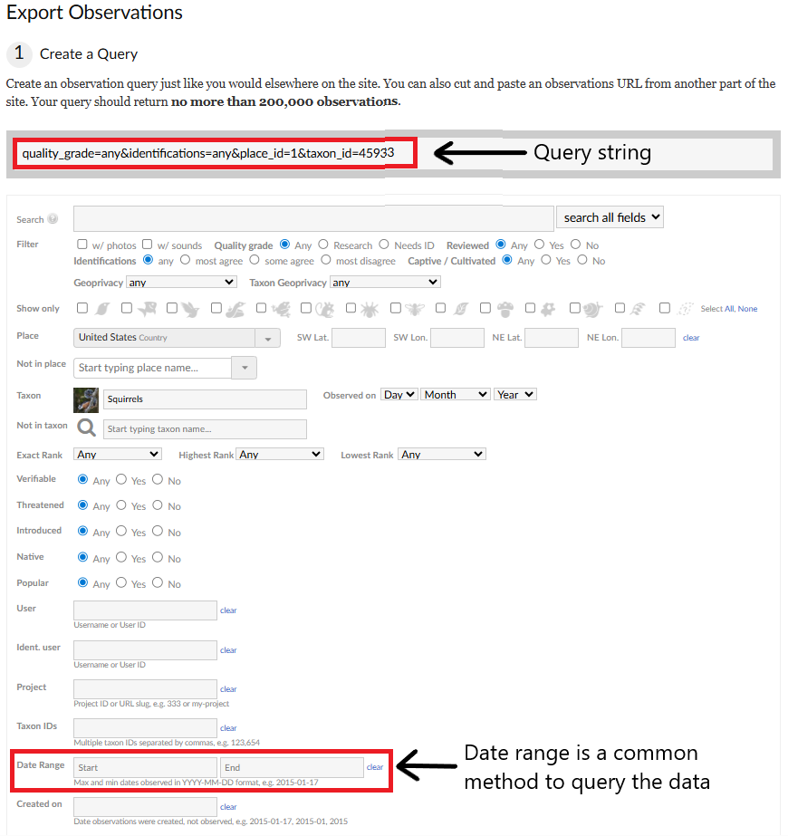

# Batch Query Data

This reference explains how to run multiple queries using the iNaturalist Export Tool and the iNaturalist API when the amount of data needed exceeds the request limits. These request limits are 200,000 for the iNaturalist Export Tool and 10,000 for the iNaturalist API. The processes for batch querying each dataset rely on the same fundamental steps, but they are executed differently. We first describe the best practices for batch queries, then outline the procedures for (1) the iNaturalist Export Tool and (2) the iNaturalist API.

## Best practices for batch queries

Batch processing data can be time-consuming and places additional strain on servers, so researchers should carefully consider whether it is necessary before running batch queries. If the required data are available through GBIF, they should be downloaded directly from [GBIF](https://www.gbif.org/). If iNaturalist exported data are needed, all possible filters should be applied before downloading. Researchers should also consider whether summarized datasets can be used instead of full observation records. For instance, if only species counts are needed, the `observations/species_counts` API endpoint should be used rather than downloading all observation data. Because the iNaturalist Export Tool allows larger batches to be downloaded, 200,000 compared to the 10,000 of the iNaturalist API, the iNaturalist Export Tool should be used when possible. Keep in mind that batch querying should not be used to scrape data. In addition to being time-intensive, excessive batch queries place unnecessary strain on the servers. This approach should be reserved for medium-sized datasets and should always follow the [API Recommended Practices](https://www.inaturalist.org/pages/api+recommended+practices). If a particular research question requires large amounts of iNaturalist export data, contact help\@inaturalist.org for support.

When querying the dataset, you should maximize the amount of data downloaded per request. When using the iNaturalist Export Tool, downloads should be close to, but not exceed, 200,000 records, while API requests should return 10,000 records or fewer. Requesting a small number of large datasets places less strain on the server than making many small requests.

## Query data on iNaturalist Export Tool

One benefit of the iNaturalist Export Tool is that it provides a preview of the data, including the number of observations returned by the query (Figure 1). To begin, enter your filtering criteria in the "Create a Query" section, then scroll down to the "Preview" section. Here, you will see a sample of the data returned by the query as well as the number of observations. If your query returns more than 200,000 results, a warning will appear stating: "Your export will be too big. Change your filters until there are fewer than 200,000 observations."



**Figure 1.** Example of the data preview in the iNaturalist Export Tool. The red box highlights the total number of results returned by the query. Because the total exceeds 200,000, there is a warning stating that the export is too large.

There are multiple ways to filter the data into subsets. One of the common methods is to filter by date using the start and end date fields (Figure 2). If start date is entered with no end date, all data after the start date will be returned. Conversely, if an end date is entered without a start date, all the data before that date will be returned. Date ranges can be adjusted iteratively until the query returns close to, but fewer than, 200,000 records. This approach is often effective because it allows precise control over the number of records returned.

Another option is to filter by taxon or place, depending on the needed dataset. Taxa can be filtered at any taxonomic level, from broad groups such as kingdoms (i.e., Plants, Animals, Fungi, etc) or at more specific levels such as family. Place filters can be applied at multiple spatial scales, including country, state, city, place ID, and others. However, this strategy is only effective if each grouping has large amounts of data that are less than 200,000. If that is not the case, then the date method is likely the best option.



**Figure 2.** Snippet of the "Create a Query" section of the iNaturalist Export Tool. The red box at the top highlights the query string, which is automatically updated as filters are applied and can be edited directly; when edited, the corresponding filter fields below are populated where applicable. The data filter fields are also highlighted, as they are commonly used to batch queries when the requested dataset exceeds 200,000 records.

Filters can be applied using the fields provided by iNaturalist or by editing the query string shown at the top of the "Create a Query" section (Figure 2). When this string is edited, the corresponding fields below are automatically populated. This approach may be more preferable when running multiple queries with a similar structure. In such cases, copy and editing the string for subsequent queries can save time. Saving these parameter strings also helps document how the data were batch queried for future reference.

Regardless of the method used, it is good practice to first define the full set of data needed and note the total number of observations. Subsequent queries should then be designed so that their parameters collectively account for all observations without overlap.

When using the iNaturalist Export Tool, keep in mind that only one request can be submitted to the iNaturalist data server at a time. The time that requests take to finish depends on available server resources. When the export is complete, the "Finished" column will populate and a download option will appear on the left of the request. At this point, the data should be downloaded and saved with a unique filename indicating that it is part of a batch query (eg. iNat_Export_Batch_1). Once the request is finished, the next query may be submitted.

## Query data using the iNaturalist API

The iNaturalist API only allows 10,000 records to be downloaded at a time, so querying this data may be pertinent. Similar queries as the iNaturalist Export Tool may be used, but the iNaturalist API offers additional parameters that may be used to query the data.

When using the iNaturalist API, you can extract the content of the request to get the total results. This can be done through the [iNaturalist API](https://api.inaturalist.org/v1/docs/#!/Observations/get_observations) webpage by entering filtering parameters then trying out the request. Under "Response Body," at the top of the text you will see total_results. This tells you how many results the query returns. Alternatively, you can do this through code by retrieving content of API request and examining the total_results data field. For example, see code snippet below:

```{r}
library(httr)
library(jsonlite)

# API Request URL
api_request <- "https://api.inaturalist.org/v1/observations?place_id=21&taxon_id=4715&order=desc&order_by=created_at"

# send HTTP GET request to the iNaturalist API
resp <- GET(api_request)

# extract the body of the HTTP response as plain text and convert to R object
data_parsed <- fromJSON(
  content(resp, as = "text", encoding = "UTF-8")
)

# View the total results
print(data_parsed$total_results)
```

If the total results is more than 10,000 then you will need to query the data. This can be done by making new API calls. While the page and per_page options can be used to create a loop to retrieve more data than the max allowed per page, this is only recommended for requests of less than 10,000 observations. Instead, iNaturalist recommends that new API calls be made using the observation ID field. To do this, adjust the API request to order by observation ID. To do this, add `order_by=id` and `order=asc` to the API request. Then the `id_above` parameter can be used to filter the dataset. We provide a code example of this in the Example R Code and the Example Python Code (see `observations-more-than-10k`).

When running batch queries keep in mind the iNaturalist query rate which is 1 request per second or about 10,000 API requests per day. Throttles should be added into code to ensure that usage is under these limits.
