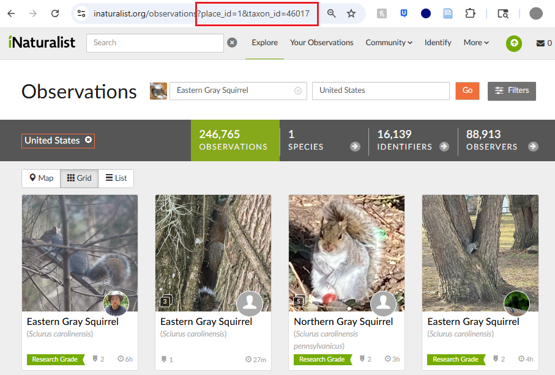

# Introduction to modifying request URLs for the API

To acquire data using the iNaturalist API, a customized URL must be constructed. The base URL for the current API version is:

```         
https://api.inaturalist.org/v1
```

From there, select an endpoint to retrieve data. The most commonly used endpoint is `observations`, but other endpoints include `places`, `projects`, `taxa`, `observation_tiles`, and more. Many endpoints also offer additional resources or paths to access specific types of data. For example, within the `observations` endpoint, you can access resources such as `histogram`, `identifiers`, `observers`, `species_counts`, and others. For example, to retrieve species counts specifically, the URL would be:

```         
https://api.inaturalist.org/v1/observations/species_counts
```

To see a list of all endpoints and available parameters, visit the [iNaturalist API website](iNaturalist%20API). The site conveniently allows users to enter parameters and automatically generates the corresponding request URL. It also provides a view of the response body and headers, which can help determine whether the desired data is returned before downloading it.

When parameters are applied, a “?” is added to the end of the base URL, and all filtering options are listed afterward. Multiple parameters are separated using “&”. For example:

```         
https://api.inaturalist.org/v1/observations?native=true&taxon_id=47157&acc_below=1000&order=desc&order_by=created_at
```

## How to acquire ID values

Many of the filtering fields are straightforward. However, some require numeric ID values, such as `taxon_id`, `place_id`, `project_id`, `site_id`, `user_id`, `user_login`, and others. If only one or a few of these ID's are needed, the easiest method to acquire these values is by using the <https://www.inaturalist.org/> website.

For `taxon_id`, navigate to the iNaturalist [Explore Page](https://www.inaturalist.org/observations) and search for the taxon of interest (Figure 1). Once the filter is applied, notice that the URL has changed to show the taxon_id. This same methodology can be applied for `place_id`, `project_id`.

To get `user_login`, navigate to the users profile page and see their username at the end of the URL. The `user_id` can be obtained by adding `.json` to the end of this URL (e.g. `https://www.inaturalist.org/people/[username].json`). This will return the JSON representation of the user’s profile. The `id` field in the JSON object corresponds to the user’s ID. If multiple user ID's are needed, then they can be obtained from iNaturalist exported data.



**Figure 1.** Using the iNaturalist [Explore Page](https://www.inaturalist.org/observations) to obtain `taxon_id` and `place_id`. In this example, a search for eastern grey squirrels in the United States was performed, and the URL updated to include the corresponding `taxon_id` and `place_id`. This indicates that the `taxon_id` of eastern grey squirrels is 46017, and the `place_id` of the United States is 1.

## How to acquire and handle many ID values

If you need many ID values, downloading summarized datasets can save time. For example, if you need the taxon_id for all species in a place, project, from a specific user, or other filtering parameter, the `observations/species_counts` endpoint returns one row per species, including its taxon_id. For places, the places endpoint offers two useful options: `places/autocomplete` to search for places beginning with a given text string, and `places/nearby` to find places within a user-defined bounding box.

When setting up a request URL that includes multiple ID values, they should be added as a comma-separated list without spaces. For example:

```         
https://api.inaturalist.org/v1/observations?taxon_id=47157,47222,51558,127588,321450
```

Alternatively, the commas can be encoded as “%2C”, which will produce the same result.

# Resources

[The iNaturalist API documentation](https://api.inaturalist.org/v1/docs/)

For a more comprehensive overview on how to use iNaturalist's search URLs see [this website](https://www.inaturalist.org/pages/search+urls).
